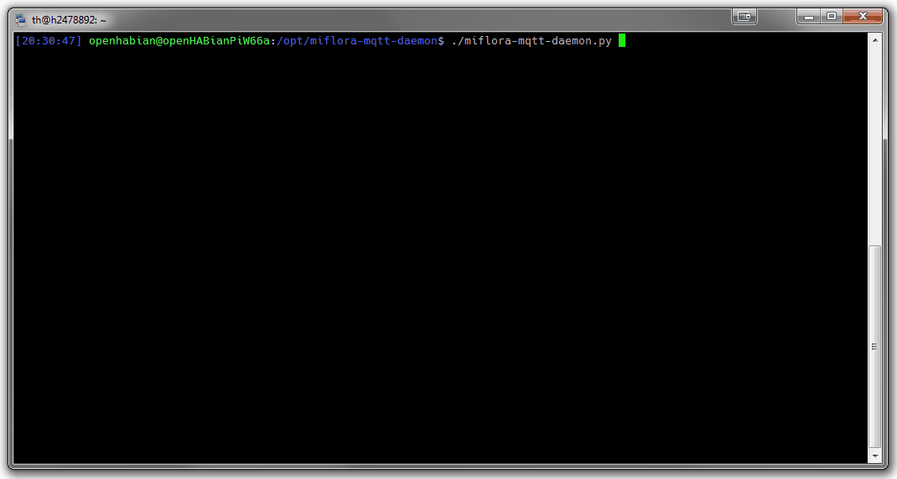

# Xiaomi Mi Flora Plant Sensor MQTT Client/Daemon

A simple Linux python script to query arbitrary Mi Flora plant sensor devices and send the data to an **MQTT** broker,
e.g., the famous [Eclipse Mosquitto](https://projects.eclipse.org/projects/technology.mosquitto).
After data made the hop to the MQTT broker it can be used by home automation software, like [openHAB](https://openhab.org) or Home Assistant.



The program can be executed for a single run or in **daemon mode** to run continuously in the background.

### Features

* Support for [Xiaomi](https://xiaomi-mi.com/sockets-and-sensors/xiaomi-huahuacaocao-flower-care-smart-monitor) [Mi Flora sensors](https://www.aliexpress.com/item/Newest-Original-Xiaomi-Flora-Monitor-Digital-Plants-Flowers-Soil-Water-Light-Tester-Sensor-Monitor-for-Aquarium/32685750372.html) (tested with firmware v2.6.2, v2.6.4, v2.6.6, v3.1.4, others anticipated)
* Build on top of [open-homeautomation/miflora](https://github.com/open-homeautomation/miflora)
* Highly configurable
* Data publication via MQTT
* JSON encoded or following the [Homie Convention](https://github.com/marvinroger/homie)
* Announcement messages to support auto-discovery services
* MQTT authentication support
* Daemon mode (default)
* Systemd service, sd\_notify messages generated
* MQTT-less mode, printing data directly to stdout/file
* Automatic generation of openHAB items and rules
* Reliable and intuitive
* Tested on Raspberry Pi 3 and 0W


### Readings

The Mi Flora sensor offers the following plant and soil readings:

| Name            | Description |
|-----------------|-------------|
| `temperature`   | Air temperature, in [°C] (0.1°C resolution) |
| `light`         | [Sunlight intensity](https://aquarium-digest.com/tag/lumenslux-requirements-of-a-cannabis-plant/), in [lux] |
| `moisture`      | [Soil moisture](https://observant.zendesk.com/hc/en-us/articles/208067926-Monitoring-Soil-Moisture-for-Optimal-Crop-Growth), in [%] |
| `conductivity`  | [Soil fertility](https://www.plantcaretools.com/measure-fertilization-with-ec-meters-for-plants-faq), in [µS/cm] |
| `battery`       | Sensor battery level, in [%] |

### Installation

On a modern Linux system just a few steps are needed.
The following example shows the installation under Debian/Raspbian below the `/opt` directory:

```shell
sudo apt install git python3 python3-pip bluetooth bluez

git clone https://github.com/ThomDietrich/miflora-mqtt-daemon.git /opt/miflora-mqtt-daemon

cd /opt/miflora-mqtt-daemon
sudo pip3 install -r requirements.txt
```

### Configuration

To match personal needs, all operation details can be configured using the file [`config.ini`](config.ini).

```shell
vim /opt/miflora-mqtt-daemon/config.ini
```

**Attention:**
You need to add at least one sensor to the configuration.
Scan for available Mi Flora sensors in your proximity with the command:

```shell
sudo hcitool lescan
```

Interfacing your Mi Flora sensor with this program is harmless.
The device will not be modified and will still work with the official Xiaomi app.

### Execution

A first test run is as easy as:

```shell
python3 /opt/miflora-mqtt-daemon/miflora-mqtt-daemon.py
```

**⚠️️ Attention:
Please ensure a good communication link to all Mi Floras.
Sensors that can not be reached during the initital communication testing phase will be ignored.
To evaluate connection reliability execute the program in from the command line at least once and pay attention to reported communication problems.**

With a correct configuration the result should look similar to the the screencap above.
Pay attention to communication errors due to distance related weak BLE connections.

The extensive output can be reduced to error messages:

```shell
python3 /opt/miflora-mqtt-daemon/miflora-mqtt-daemon.py > /dev/null
```

#### Continuous Daemon/Service

You most probably want to execute the program **continuously in the background**.
This can be done either by using the internal daemon or cron.

**Attention:** Daemon mode must be enabled in the configuration file (default).

1. Systemd service - on systemd powered systems the **recommended** option
   
   ```shell
   sudo cp /opt/miflora-mqtt-daemon/template.service /etc/systemd/system/miflora.service

   sudo systemctl daemon-reload

   sudo systemctl start miflora.service
   sudo systemctl status miflora.service

   sudo systemctl enable miflora.service
   ```

1. Screen Shell - Run the program inside a [screen shell](https://www.howtoforge.com/linux_screen):
   
   ```shell
   screen -S miflora-mqtt-daemon -d -m python3 /path/to/miflora-mqtt-daemon.py
   ```

### Integration

In the "mqtt-json" reporting mode, data will be published to the MQTT broker topic "`miflora/sensorname`" (names configurable).
An example:

```json
{"light": 5424, "moisture": 30, "temperature": 21.4, "conductivity": 1020, "battery": 100}
```

This data can be subscribed to and processed by other applications, like [openHAB](https://openhab.org).

Enjoy!

----

#### Disclaimer and Legal

> *Xiaomi* and *Mi Flora* are registered trademarks of *BEIJING XIAOMI TECHNOLOGY CO., LTD.*
> 
> This project is a community project not for commercial use.
> The authors will not be held responsible in the event of device failure or other damages. 
> 
> This project is in no way affiliated with, authorized, maintained, sponsored or endorsed by *Xiaomi* or any of its affiliates or subsidiaries.

